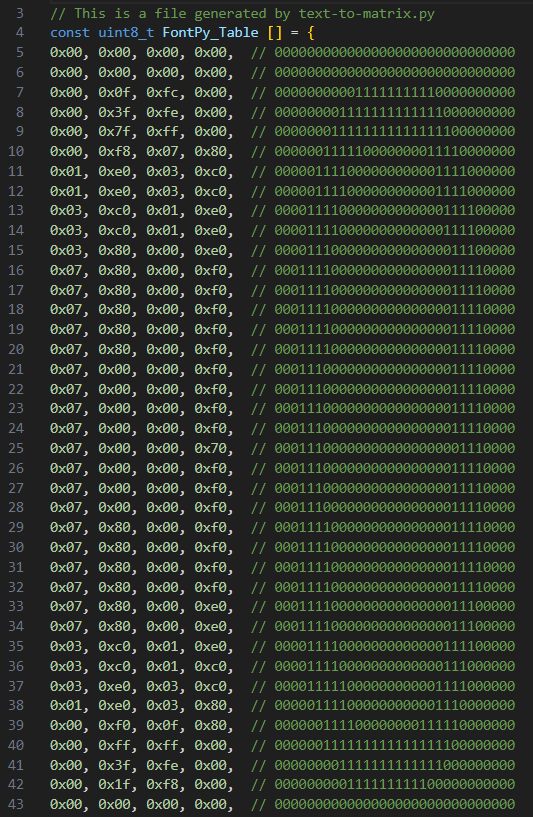

# Font to Pixel Bitmap Generator

This repository contains a Python script that converts characters from a TrueType Font (TTF) into pixel bitmaps. The font size can be determined based on either the height or width of the letters. The script outputs a C++ file, suitable for use with displays connected to Arduino.




## Usage:

### Prerequisites:

Make sure you have the required Python packages installed. You can install them using:

```pip install pillow numpy```

### Running the Script:

1. Clone the repository:

   ```git clone https://github.com/your-username/font-to-pixel-bitmap.git```

2. Navigate to the repository:

   ```cd font-to-pixel-bitmap```

3. Edit the global constant values (in 'font_to_pixel_bitmap.py') to customize font path, output file path, and other parameters.

4. Run the script:

   ```python font_to_pixel_bitmap.py```

The generated file (e.g. 'output_file.cpp') will be created in the specified output path.

Parameters:

- ```font_path```: Path to ttf font
- ```output_file_path```: Path to output file
- ```all_letters```: All letters in the resulting bitmap
- ```output_fill```: String to write when pixel is on 
- ```output_empty```: String to write when pixel is off
- ```output_separator```: String to write on every line before output string
- ```output_hexa```: When true, write hexa bytes on every line before output string
- ```font_size_option```: Options for determining font size. See font_to_pixel_bitmap.py for more details.
- ```generate_header```: Get string to write at beginning of the file
- ```generate_footer```: Get string to write at the end of the file

### Examples:

   python font_to_pixel_bitmap.py

### License:

This project is licensed under the GPL License - see the LICENSE.GPL file for details.
